# User Story Workflow

The user story workflow is a set of statuses that a user story can go through during its lifecycle. The workflow is important because it helps the team to understand the current status of the user story and what needs to be done next. The workflow also helps to standardize the process that the team will follow to complete the user story.

In this section, we will define the user story workflow and define the workflow scheme that will be used in the project.

## Statuses

The user story workflow will include the following statuses:

| Status                       | Category    | Role               | When                                                                                  |
| ---------------------------- | ----------- | ------------------ | ------------------------------------------------------------------------------------- |
| **Busniess Phase**           |             |                    |                                                                                       |
| **Draft**                    | Todo        | Product Owner      | Create a new user story and add it to the backlog.                                    |
| **BA Progress**              | In Progress | Product Owner      | Analyze the user story and create the acceptance criteria.                            |
| **Stakeholder Review**       | Todo        | Stakeholder        | If needed, review the user story and provide feedback.                                |
| **UI/UX Phase**              |             |                    |                                                                                       |
| **Ready for Design**         | Todo        | UI/UX Designer     | Ready for Design the user story and create the wireframes.                            |
| **Analysis and Design**      | In Progress | UI/UX Designer     | Analyze the user story and create the mockups.                                        |
| **Refinement Phase**         |             |                    |                                                                                       |
| **Ready for Refinement**     | Todo        | Development Leader | Ready for Refinement the user story and create the tasks.                             |
| **Refinement**               | In Progress | Development Leader | Refine the user story and create the sub-tasks.                                       |
| **Development Phase**        |             |                    |                                                                                       |
| **Ready for Development**    | Todo        | Development Team   | Ready for Development the user story and start the coding.                            |
| **Development**              | In Progress | Development Team   | Develop the user story and create the pull request.                                   |
| **Review Phase**             |             |                    |                                                                                       |
| **Ready for Review**         | Todo        | Development Leader | Ready for Review the user story and start the review.                                 |
| **Review**                   | In Progress | Development Leader | Review the user story and provide feedback.                                           |
| **Testing Phase**            |             |                    |                                                                                       |
| **Ready for SIT**            | Todo        | QA Team            | Ready for SIT the user story and start the testing. (SIT: System Integration Testing) |
| **SIT**                      | In Progress | QA Team            | Test the user story and execute the test cases.                                       |
| **Ready for UAT**            | Todo        | Product Owner      | Ready for UAT the user story and start the testing. (UAT: User Acceptance Testing)    |
| **UAT**                      | In Progress | Product Owner      | Test the user story according to the acceptance criteria.                             |
| **Release Phase**            |             |                    |                                                                                       |
| **Plan Release Version**     | In Progress | Development Leader | Plan the release version and create the release notes.                                |
| **Allocate Release Version** | In Progress | Development Leader | Allocate the release version and create the deployment plan.                          |
| **Done Phase**               |             |                    |                                                                                       |
| **Ready for Release**        | Done        | Development Leader | Ready for Release the user story and start the deployment.                            |
| **Closed**                   | Done        | Development Leader | Close the user story and mark it as done.                                             |
| **Cancelled**                | Done        | Development Leader | Cancel the user story and mark it as cancelled.                                       |
| **PIV**                      | Done        | Development Leader | Put the user story in the product backlog and mark it as PIV.                         |
| **Partially Closed**         | Done        | Development Leader | Partially close the user story and mark it as partially closed.                       |
| **Additional Status**        |             |                    |                                                                                       |
| **On Hold**                  | In Progress | Development Leader | Put the user story on hold and mark it as on hold.                                    |

## Workflow Scheme

The user story workflow scheme will include the following transitions:

### Business Phase

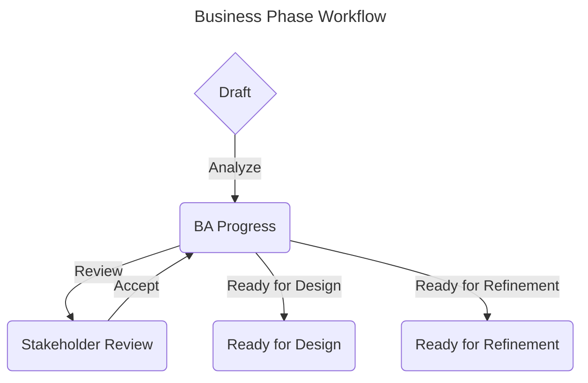

### UI/UX Phase

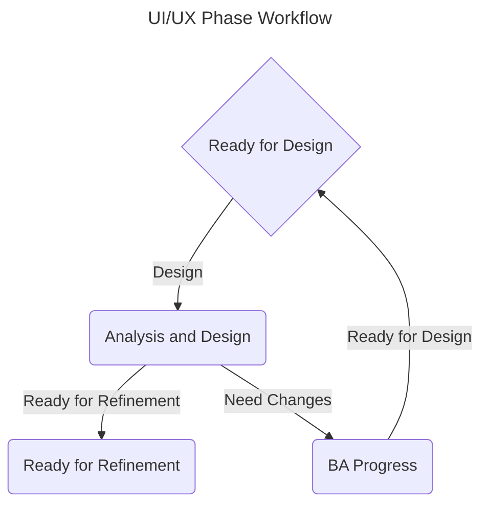

### Refinement Phase

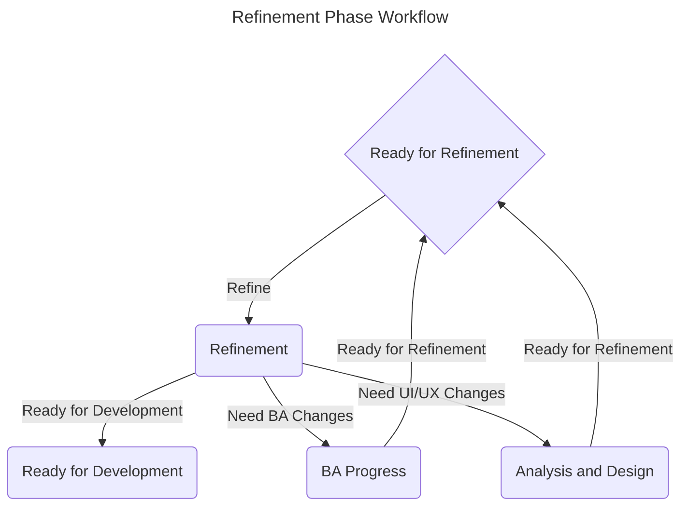

### Development Phase

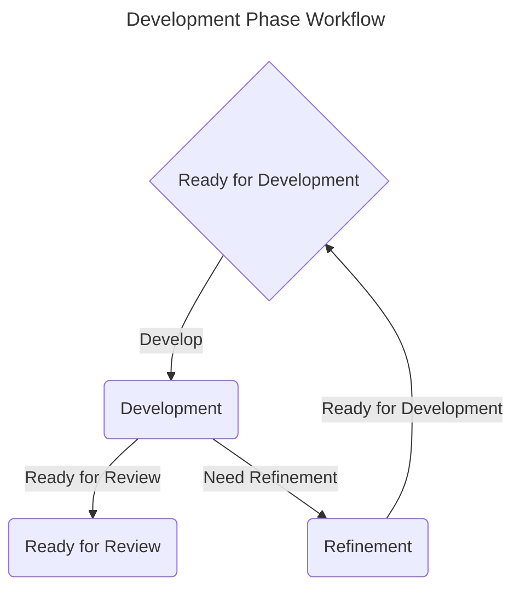

### Review Phase

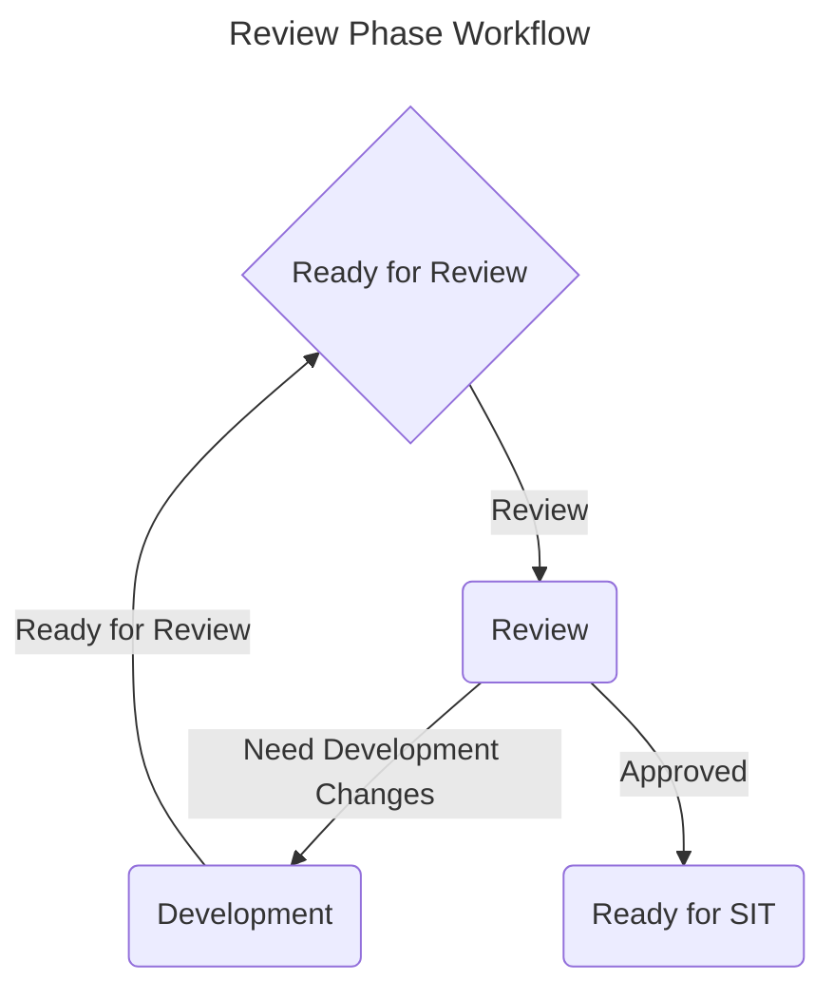

### Testing Phase

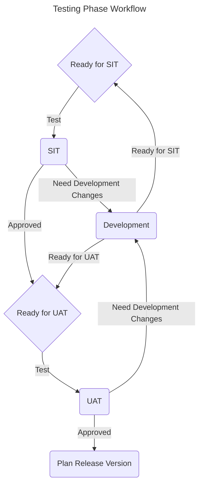

### Release Phase

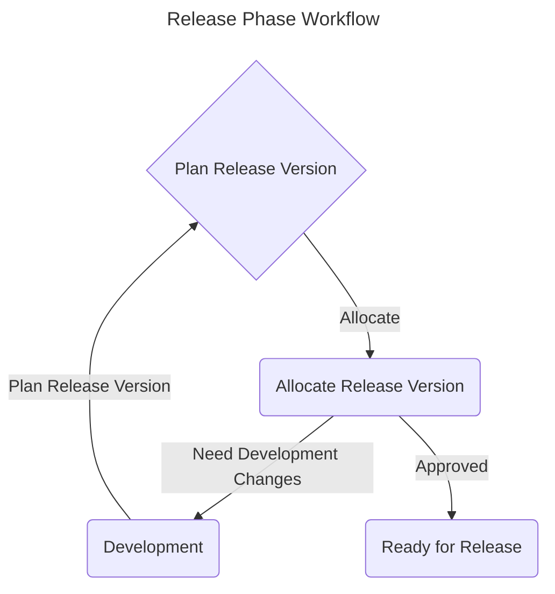

### Done Phase

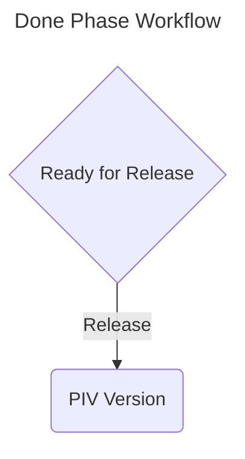

### Additional Status

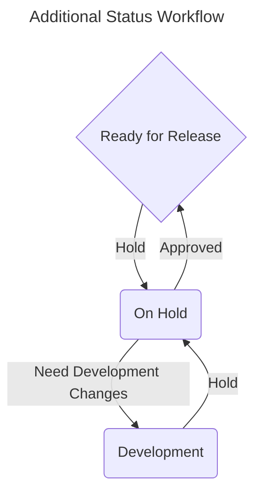

## Examples

### Backlog Timeline Example

User story status that should worked on while the user story is in the backlog:

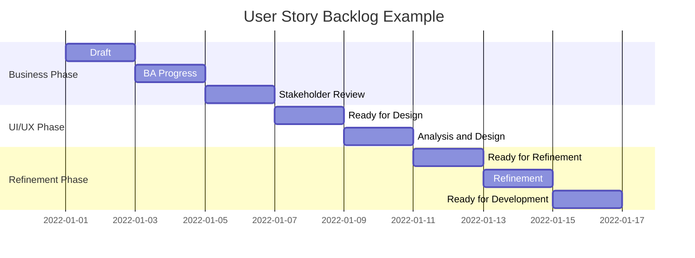

### Sprint Timeline Example

User story status that should worked on while the user story is in the sprint:

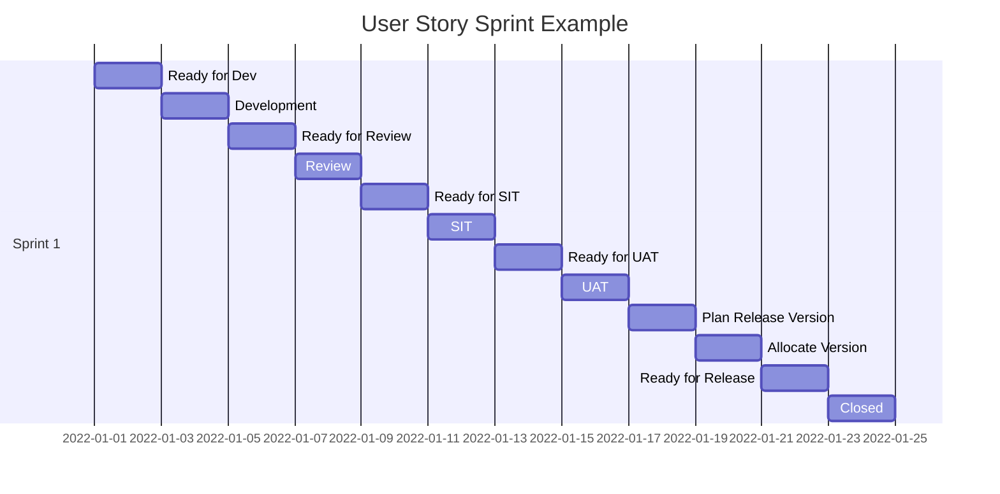

## Conclusion

The user story workflow is a set of statuses that a user story can go through during its lifecycle. The workflow is important because it helps the team to understand the current status of the user story and what needs to be done next. The workflow also helps to standardize the process that the team will follow to complete the user story. By defining the user story workflow and workflow scheme, the team can work together more effectively and efficiently. The user story workflow will help the team to complete the user stories on time and deliver the project successfully.
