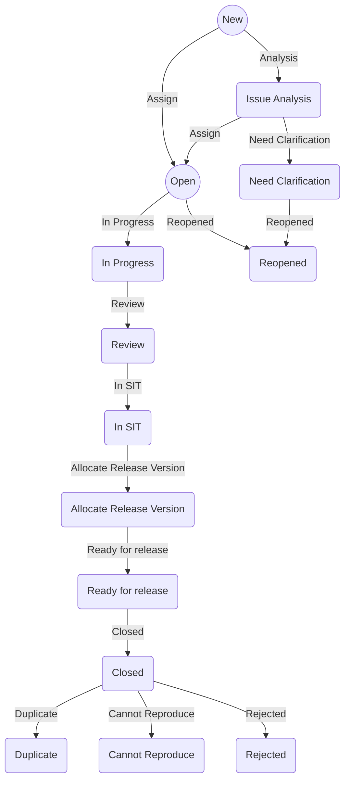

# Bug Workflow

The bug workflow is a set of statuses that a bug can go through during its lifecycle. The bug workflow is important because it helps the team to understand the current status of the bug and what needs to be done next. The bug workflow also helps to standardize the process that the team will follow to fix the bug.

In this section, we will define the bug workflow and the bug workflow schemes that will be used in the project.

## Statuses

The bug workflow will include the following statuses:

| Status                       | Description                                                           | Category    |
| ---------------------------- | --------------------------------------------------------------------- | ----------- |
| **New**                      | The bug is new and has not been assigned to anyone yet.               | Todo        |
| **Issue Analysis**           | Understand the bug and analyze the root cause and adding fix details. | Todo        |
| **Need Clarification**       | If the bug is not clear, then it will be moved to this status.        | Todo        |
| **Reopened**                 | The bug is reopened because the fix is not correct.                   | Todo        |
| **Open**                     | Open and assigned to a developer.                                     | In-Progress |
| **In Progress**              | Developer start working on the bug.                                   | In-Progress |
| **Review**                   | Developer has fixed the bug and it is ready for code review.          | In-Progress |
| **In SIT**                   | The bug is in the system integration testing phase.                   | In-Progress |
| **Allocate Release Version** | Allocate the release version for the bug.                             | In-Progress |
| **Ready for release**        | The bug is ready to be released.                                      | In-Progress |
| **Closed**                   | The bug is fixed and closed.                                          | Done        |
| **Duplicate**                | The bug is a duplicate of another bug.                                | Done        |
| **Cannot Reproduce**         | The bug cannot be reproduced.                                         | Done        |
| **Rejected**                 | The bug is rejected.                                                  | Done        |

## Workflow

The bug workflow will include the following steps:

