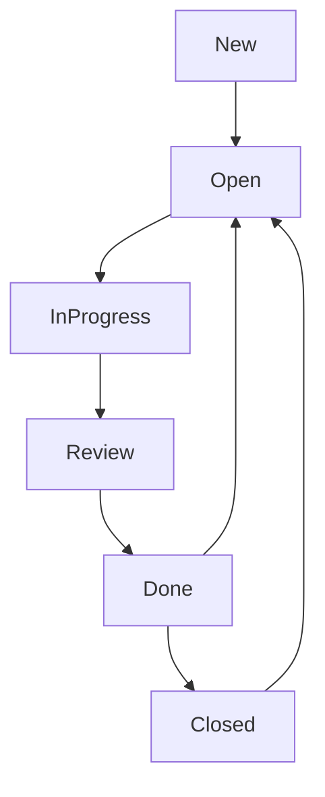

# Task Workflow

The task workflow is a process that helps teams to manage and track the progress of tasks in a project. The task workflow is a part of the project management process and is used to manage the tasks that need to be completed in a project. The task workflow helps teams to organize and prioritize tasks, assign tasks to team members, track the progress of tasks, and ensure that tasks are completed on time.

In this section, we will define the task workflow and the task workflow schemes that will be used in the project.

## Statuses

The task workflow will include the following statuses:

| Status          | Description                                              | Category    |
| --------------- | -------------------------------------------------------- | ----------- |
| **New**         | The task is new and has not been assigned to anyone yet. | Todo        |
| **Open**        | The task is open and assigned to a team member.          | In-Progress |
| **In Progress** | The team member has started working on the task.         | In-Progress |
| **Review**      | The task is ready for review.                            | In-Progress |
| **Done**        | The task is completed.                                   | Done        |
| **Closed**      | The task is closed.                                      | Done        |

## Workflow

The task workflow will follow the following process:

