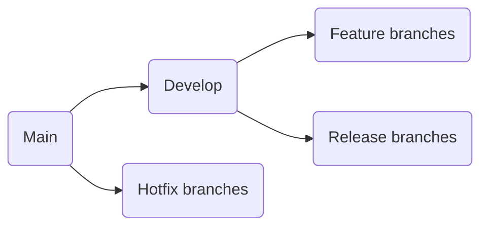
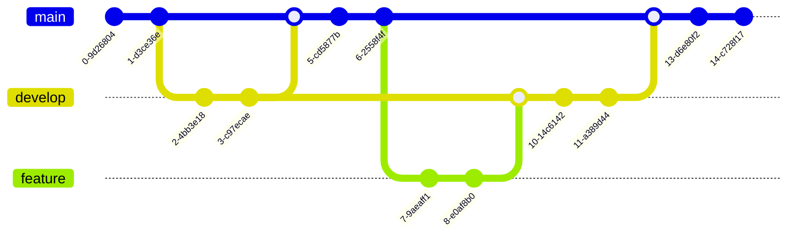
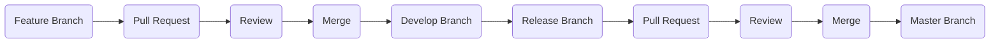

# Git Strategy

This document outlines the git strategy that we will be using for our project. The git strategy defines the branching model, commit guidelines, and pull request process that we will follow.

## Branching Strategy

We will be using the [Gitflow Workflow](https://www.atlassian.com/git/tutorials/comparing-workflows/gitflow-workflow) for our branching strategy. The Gitflow Workflow is a branching model that defines a strict branching model designed around the project release. It assigns specific roles to different branches and defines how and when they should interact.

### The Gitflow Workflow consists of the following branches:

- **Main**: The main branch is the main branch where the source code of HEAD always reflects a production-ready state.
- **Develop**: The develop branch is used for integration and testing of features before they are merged into the master branch.
- **Feature branches**: Feature branches are used to develop new features for the upcoming or a distant future release. They are based on the develop branch and are merged back into the develop branch once the feature is complete.
- **Release branches**: Release branches support preparation of a new production release. They allow for last-minute changes and bug fixes before the release is deployed to production. They are based on the develop branch and are merged into both the master and develop branches once the release is ready.
- **Hotfix branches**: Hotfix branches are used to quickly patch production releases. They are based on the master branch and are merged into both the master and develop branches once the hotfix is complete.

### Branch Naming Convention

- **Feature branches**: `feature/<feature-name>`
- **Release branches**: `release/<version>`
- **Hotfix branches**: `hotfix/<version>`

### Branching Process

#### Feature Branches

1. Create a new feature branch from the develop branch.
2. Implement the feature on the feature branch.
3. Create a pull request to merge the feature branch into the develop branch.
4. Review the pull request and merge the feature branch into the develop branch.
5. Delete the feature branch.

#### Release Branches

1. Create a new release branch from the develop branch.
2. Prepare the release on the release branch.
3. Create a pull request to merge the release branch into the master branch.
4. Create a pull request to merge the release branch into the develop branch.
5. Review the pull requests and merge the release branch into the master and develop branches.
6. Delete the release branch.

#### Hotfix Branches

1. Create a new hotfix branch from the master branch.
2. Implement the hotfix on the hotfix branch.
3. Create a pull request to merge the hotfix branch into the master branch.
4. Create a pull request to merge the hotfix branch into the develop branch.
5. Review the pull requests and merge the hotfix branch into the master and develop branches.
6. Delete the hotfix branch.
7. Tag the master branch with the hotfix version.
8. Update the develop branch with the hotfix changes.
9. Tag the develop branch with the hotfix version.

### Branching Diagram

The following diagram illustrates the branching model of the Gitflow Workflow:



### Branching Diagram Example



## Commit Guidelines

We will be following the [Conventional Commits](https://www.conventionalcommits.org/en/v1.0.0/) specification for our commit messages. Conventional Commits is a lightweight convention on top of commit messages. It provides an easy set of rules for creating an explicit commit history.

### Commit Message Format

A commit message consists of a header, body, and footer. The header has a special format that includes a type, scope, and subject:

```
<type>(<scope>): <subject>
<BLANK LINE>
<body>
<BLANK LINE>
<footer>
```

- **Type**: The type of the commit, such as `feat`, `fix`, `docs`, `style`, `refactor`, `test`, or `chore`.
- **Scope**: The scope of the commit, such as a module or component.
- **Subject**: A short description of the change.
- **Body**: A detailed description of the change.
- **Footer**: Additional information, such as breaking changes or issue references.
- **Blank Line**: A blank line between the header, body, and footer.

### Commit Message Examples

- **Feature Commit**:

```powershell
  feat(auth): add login functionality
```

- **Fix Commit**:

```commit
    fix(auth): fix login issue
```

- **Documentation Commit**:

```commit
    docs(readme): update project documentation
```

- **Style Commit**:

```commit
    style(auth): format login component
```

## Pull Request Process

We will be using the following process for creating and reviewing pull requests:

1. Create a new feature branch from the develop branch.
2. Implement the feature on the feature branch.
3. Create a pull request to merge the feature branch into the develop branch.
4. Assign reviewers to the pull request.
5. Review the pull request and provide feedback.
6. Make changes based on the feedback.
7. Merge the pull request into the develop branch.
8. Delete the feature branch.
9. Repeat the process for each feature.
10. Create a release branch from the develop branch.
11. Prepare the release on the release branch.
12. Create a pull request to merge the release branch into the master branch.

### Pull Request Checklist

- [ ] Assign reviewers to the pull request.
- [ ] Review the pull request and provide feedback.
- [ ] Make changes based on the feedback.
- [ ] Merge the pull request into the develop branch.
- [ ] Delete the feature branch.
- [ ] Create a release branch from the develop branch.
- [ ] Prepare the release on the release branch.
- [ ] Create a pull request to merge the release branch into the master branch.
- [ ] Review the pull request and merge the release branch into the master branch.
- [ ] Tag the master branch with the release version.
- [ ] Tag the develop branch with the release version.
- [ ] Delete the release branch.

## Code Review Process

The code review process is an essential part of our development workflow. It helps ensure that the code is of high quality, follows best practices, and meets the project requirements.

### Code Review Guidelines

- **Code Quality**: Review the code for readability, maintainability, and performance.
- **Best Practices**: Ensure that the code follows best practices and coding standards.
- **Functionality**: Verify that the code implements the required functionality and meets the project requirements.
- **Testing**: Check that the code is adequately tested and that the tests cover all use cases.
- **Documentation**: Ensure that the code is well-documented and that the documentation is up-to-date.
- **Security**: Review the code for security vulnerabilities and ensure that sensitive data is handled securely.

### Code Review Checklist

- [ ] Check the code for readability, maintainability, and performance.
- [ ] Ensure that the code follows best practices and coding standards.
- [ ] Verify that the code implements the required functionality and meets the project requirements.
- [ ] Check that the code is adequately tested and that the tests cover all use cases.
- [ ] Ensure that the code is well-documented and that the documentation is up-to-date.
- [ ] Review the code for security vulnerabilities and ensure that sensitive data is handled securely.
- [ ] Provide constructive feedback and suggestions for improvement.
- [ ] Approve the code changes once they meet the project requirements.
- [ ] Merge the code changes into the develop branch.
- [ ] Delete the feature branch.
- [ ] Repeat the process for each feature.

## Workflow Diagram

The following diagram illustrates the workflow of the Git strategy:


